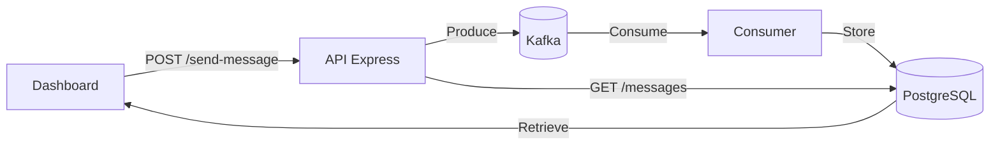

# 🚀 TP6 – Système de Messagerie Temps Réel avec Kafka

## 🖼️ Interface du Dashboard Développé :


## 🎯 Objectifs du TP

- ✔️ Implémenter un producteur et un consommateur Kafka  
- ✔️ Persister les messages dans une base PostgreSQL  
- ✔️ Développer une interface de visualisation (dashboard)  
- ✔️ Concevoir une API REST avec Express  

---

## 🏗️ Architecture Technique



---

## 🗂️ Structure du Projet

```
TP6-Kafka/
├── public/               # Frontend (HTML/CSS/JS)
│   ├── css/style.css
│   ├── js/script.js
│   └── index.html
├── server.js             # API REST Express
├── producer.js           # Producteur Kafka
├── consumer.js           # Consommateur Kafka + PostgreSQL
├── package.json          # Dépendances
├── .env.example          # Fichier d'exemple pour la configuration
└── README.md             # Documentation
```

---

## ⚙️ Installation & Configuration

### 📥 Installation

```bash
git clone https://github.com/RaefGaied/TP-SOA-Microservices.git
cd TP-SOA-Microservices
git checkout TP6-Kafka
npm install
cp .env.example .env
```

---

### 🧾 Configuration du fichier `.env`

#### Kafka

```env
KAFKA_BROKERS=localhost:9092
KAFKA_TOPIC=tp6-messages
```

#### PostgreSQL

```env
PGUSER=postgres
PGPASSWORD=mot_de_passe
PGDATABASE=kafka_tp6
```

---

## 🚀 Lancement de l’Application

### Mode manuel (lancement étape par étape)

#### 🖥️ Terminal 1 – Producteur Kafka

```bash
node producer.js
# ➜ Lance le producteur Kafka (envoi automatique de messages à intervalle régulier)
```

#### 🖥️ Terminal 2 – Consommateur Kafka

```bash
node consumer.js
# ➜ Démarre le consommateur Kafka (stocke les messages dans PostgreSQL)
```

#### 🖥️ Terminal 3 – Serveur Express

```bash
node server.js
# ➜ Démarre le serveur Express en mode classique (production)
```

ou

```bash
npm run dev
# ➜ Démarre le serveur en mode développement (avec redémarrage automatique)
```

➡️ Accéder au dashboard : [http://localhost:3000](http://localhost:3000)

---

## ⚙️ Fonctionnalités

### 🖥 Frontend (Dashboard)

- Envoi de messages en mode manuel ou automatique
- Affichage en temps réel des messages
- Interface responsive avec Bootstrap

### 🛠 Backend (API Express)

#### Endpoints REST :

- `POST /send-message` → Envoie un message  
- `GET /messages` → Récupère tous les messages

#### Sécurité :

- Validation des entrées  
- Gestion des erreurs  

---

## 📊 Résultats de Test

- **Test de performance :**  
  - 1000 messages envoyés en 12.4 secondes  
  - Débit moyen : ~80 msg/sec  
  - Latence moyenne : 45 ms  

---

## 📝 Compte Rendu

### ❗ Difficultés Rencontrées

- Synchronisation entre Kafka et PostgreSQL  
- Gestion des connexions simultanées  
- Intégration temps réel dans le dashboard  

### ✅ Solutions Apportées

- Mise en place d’un mécanisme de reconnexion automatique  
- Contrôle du flux de messages  
- Optimisation des requêtes SQL
